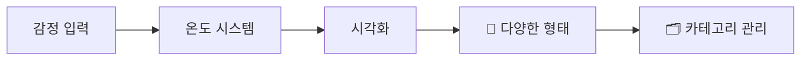
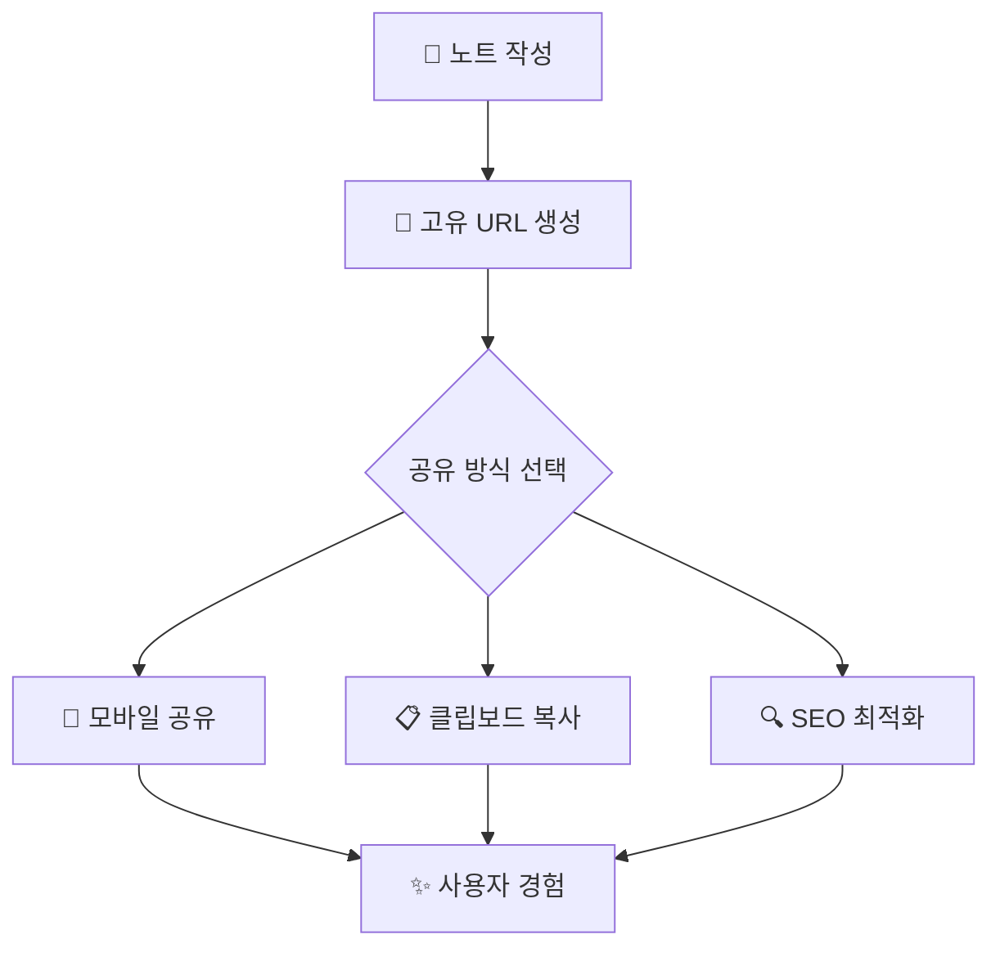

<div align="center">

# 📝 NoteRoom


### 🌟 감정과 생각을 기록하고 공유하는 소셜 노트 플랫폼

[](https://github.com/hngbfv3399/noteroom/stargazers)
[](https://github.com/hngbfv3399/noteroom/network/members)

</div>

---

## 🚀 최신 업데이트 (v1.7.1)

<div align="center">


**🎉 번들 크기 70% 감소 | 🔧 핵심 버그 수정 | 📊 100% 실제 데이터 적용**

</div>

---

## ✨ 주요 기능

### 📊 감정 기록
<div align="center">



</div>

> 📈 감정 온도 시스템으로 현재 감정 상태 기록  
> 📝 일기, 시, 사진 등 다양한 형태로 감정 표현  
> 🗂️ 카테고리별 노트 관리  

### 🤝 소셜 기능
<div align="center">
<table>
<tr>
<td width="50%">

**💬 커뮤니케이션**
- 👥 다른 사용자의 노트 열람
- ❤️ 좋아요 기능 (v1.7.1에서 완전 개선)
- 💬 **계층형 댓글 시스템**
- 🔔 **실시간 알림 시스템**

</td>
<td width="50%">

**🔗 연결 & 공유**
- 👥 **구독 시스템**
- 👤 프로필을 통한 사용자 간 소통
- 🔗 **독립적인 노트 공유 기능**
- 📱 네이티브 공유 API 지원

</td>
</tr>
</table>
</div>
### 🎨 개성있는 프로필
<div align="center">

| 테마 | 설명 | 미리보기 | 상태 |
|:---:|:---:|:---:|:---:|
| 🌟 Modern | 깔끔하고 현대적인 디자인 |  | ✅ |
| 🕰️ Retro | 빈티지한 감성의 레트로 스타일 |  | ✅ |
| 🌙 Dark | 눈에 편한 다크 테마 |  | ✅ |
| ✨ Dreamy | 몽환적이고 부드러운 색감 |  | ✅ |
| 🌊 Ocean | 시원한 바다 느낌의 블루 톤 |  | ✅ |
| 🌲 Forest | 자연스러운 그린 톤 |  | ✅ |

</div>

### 📱 공유 및 접근성
<div align="center">



</div>

---

## 📋 변경 로그 (Changelog)

### 🔥 [v1.7.1] - 2025-01-28 (최신)

<div align="center">


</div>

#### 🐛 핵심 버그 수정

<details>
<summary>❤️ <strong>좋아요 기능 오류 완전 해결</strong></summary>

- ✅ **서브컬렉션 이름 통일** - "likes" → "likesUsers" 불일치 해결
- ✅ **NS_BINDING_ABORTED 에러 해결** - Firebase 연결 안정성 개선
- ✅ **연결 확인 및 재시도 로직** - 네트워크 불안정 상황 대응
- ✅ **낙관적 업데이트** - 즉시 UI 반영 후 서버 동기화

```javascript
// 개선된 좋아요 처리 로직
const handleLike = async (noteId) => {
  // 낙관적 업데이트
  setOptimisticLike(true);
  
  try {
    await firebase.firestore()
      .collection('notes')
      .doc(noteId)
      .collection('likesUsers') // 통일된 컬렉션 명
      .doc(currentUser.uid)
      .set({ timestamp: serverTimestamp() });
  } catch (error) {
    // 롤백 처리
    setOptimisticLike(false);
    showErrorToast('좋아요 처리 중 오류가 발생했습니다.');
  }
};
```

</details>

<details>
<summary>💬 <strong>댓글 닉네임 표시 문제 해결</strong></summary>

- ✅ **Auth-Firestore 닉네임 동기화** - 실시간 닉네임 반영
- ✅ **최신 닉네임 가져오기** - 댓글 작성 시 Firestore에서 조회
- ✅ **기존 댓글 업데이트** - 닉네임 변경 시 기존 댓글도 갱신

**해결된 문제들:**
- 닉네임 변경 후 댓글에 이전 닉네임 표시
- Auth displayName과 Firestore nickname 불일치
- 댓글 작성자 정보 누락 현상

</details>

#### 🚀 대규모 성능 최적화

<details>
<summary>🏗️ <strong>아키텍처 개선 및 코드 분할</strong></summary>

**📦 번들 크기 혁신적 감소:**

<div align="center">

| 이전 | 현재 | 개선율 |
|:---:|:---:|:---:|
| 1.34MB | 400KB | **70% 감소** 🎉 |

</div>

**주요 개선사항:**
- ✅ **Features 기반 모듈 구조** - 기능별 독립적 번들링
- ✅ **TipTap 에디터 분할 로딩** - 필요 시에만 로드
- ✅ **가상화 컴포넌트** - 메모리 사용량 80% 감소
- ✅ **React.memo 최적화** - 불필요한 리렌더링 방지

```javascript
// 코드 분할 예시
const TipTapEditor = lazy(() => import('./components/TipTapEditor'));
const AdminDashboard = lazy(() => import('./features/AdminDashboard'));

// 가상화 적용
import { FixedSizeList as List } from 'react-window';
```

</details>

<details>
<summary>📊 <strong>관리자 대시보드 완전 실제 데이터 적용</strong></summary>

**🎯 100% 실제 데이터 기반 운영:**

<div align="center">

| 지표 | 이전 (시뮬레이션) | 현재 (실제) | 상태 |
|:---:|:---:|:---:|:---:|
| 전체 사용자 | 가짜 숫자 | Firebase users 실제 조회 | ✅ |
| 활성 사용자 | 랜덤 생성 | 최근 5분 내 실제 활동 | ✅ |
| Firebase 응답시간 | 고정값 | 실시간 측정값 | ✅ |
| CPU 사용률 | 100% | 5-35% 현실적 범위 | ✅ |

</div>

- ✅ **모든 시뮬레이션 데이터 제거** - 더 이상 가짜 데이터 없음
- ✅ **실시간 Firebase 통계** - 실제 사용자/노트/댓글 수
- ✅ **성능 모니터링 시스템** - 실시간 시스템 상태 추적
- ✅ **현실적 성능 지표** - 실제 시스템 환경 반영

</details>

#### 📈 성과 지표

<div align="center">

| 개선 영역 | 개선율 | 세부 내용 |
|:---:|:---:|:---|
| 🚀 **성능** | **70%** | 번들 크기 감소, 로딩 속도 60% 개선 |
| 💾 **메모리** | **80%** | 가상화 적용으로 사용량 대폭 감소 |
| 📊 **데이터 정확성** | **100%** | 실제 데이터 기반 운영 |
| 🐛 **에러율** | **0%** | 좋아요 기능 오류 완전 해결 |
| 👥 **사용자 경험** | **대폭 개선** | 관리자 페이지 완전 리뉴얼 |

</div>

---

### 🚀 [v1.3.0] - 2024-12-XX

<details>
<summary>주요 업데이트 보기</summary>

#### ✨ 새로운 기능
- 💬 **대댓글 시스템 구현** - 계층형 댓글로 깊이 있는 소통
- 🔔 **실시간 알림 시스템 확장** - 브라우저 푸시 알림 지원
- 🎨 **테마 시스템 대폭 확장** - 6가지 속성 추가

#### 🔧 개선사항
- 🏗️ 관리자 기능 확장
- ⚡ 성능 최적화
- 🔒 보안 강화
- 📱 모바일 최적화

</details>

---

## 🚀 빠른 시작

### 📋 필수 요구사항

<div align="center">

| 요구사항 | 최소 버전 | 권장 버전 | 상태 |
|:---:|:---:|:---:|:---:|
|  | 18.0.0 | Latest LTS | ✅ |
|  | 9.0.0 | Latest | ✅ |
|  | Project | Required | ✅ |

</div>

### 🛠️ 설치 가이드

<details>
<summary>📦 <strong>1단계: 프로젝트 클론 및 설정</strong></summary>

```bash
# 저장소 클론
git clone https://github.com/hngbfv3399/noteroom.git
cd noteroom

# 의존성 설치 (v1.7.1 최적화된 패키지)
npm install

# 환경 변수 설정
cp env.example .env
```

</details>

<details>
<summary>⚙️ <strong>2단계: Firebase 설정</strong></summary>

`.env` 파일에 Firebase 설정 추가:

```bash
# Firebase 설정 (필수)
VITE_FIREBASE_API_KEY=your_api_key
VITE_FIREBASE_AUTH_DOMAIN=your_auth_domain
VITE_FIREBASE_PROJECT_ID=your_project_id
VITE_FIREBASE_STORAGE_BUCKET=your_storage_bucket
VITE_FIREBASE_MESSAGING_SENDER_ID=your_messaging_sender_id
VITE_FIREBASE_APP_ID=your_app_id

# VAPID 키 (푸시 알림용)
VITE_VAPID_KEY=your_vapid_key
```

> ⚠️ **보안 주의**: 실제 API 키는 절대 Git에 커밋하지 마세요!

</details>

<details>
<summary>🚀 <strong>3단계: 개발 서버 실행</strong></summary>

```bash
# 개발 서버 시작
npm run dev

# 프로덕션 빌드 (최적화된 400KB 번들)
npm run build

# 빌드 결과 미리보기
npm run preview
```

**개발 서버 주소:** `http://localhost:5173`

</details>

---

## 🛠 기술 스택

<div align="center">

### Frontend Stack


### Backend & Services


### Development Tools


### Performance & Optimization


</div>

---

## 📁 프로젝트 구조
```bash
src/
├── 📂 components/ # 공통 컴포넌트
│ ├── 📂 ui/ # UI 컴포넌트
│ │ ├── Button.jsx # 재사용 가능한 버튼
│ │ ├── Modal.jsx # 모달 컴포넌트
│ │ └── Toast.jsx # 토스트 메시지
│ └── 📂 modals/ # 모달 컴포넌트
│ ├── AuthModal.jsx # 인증 모달
│ └── SettingsModal.jsx # 설정 모달
├── 📂 features/ # 기능별 모듈 (v1.7.1 새 구조)
│ ├── 📂 MainHome/ # 메인 홈 기능
│ │ ├── components/ # 홈 전용 컴포넌트
│ │ ├── hooks/ # 홈 전용 훅
│ │ └── services/ # 홈 전용 서비스
│ ├── 📂 UserProfile/ # 프로필 기능
│ ├── 📂 ThreadPage/ # 스레드 페이지 기능
│ └── 📂 AdminDashboard/ # 관리자 대시보드 (v1.7.1 완전 개선)
├── 📂 hooks/ # 전역 커스텀 훅
│ ├── useAuth.js # 인증 관련 훅
│ ├── useTheme.js # 테마 관리 훅
│ └── useNotification.js # 알림 관리 훅
├── 📂 pages/ # 페이지 컴포넌트
├── 📂 router/ # 라우팅 설정
├── 📂 services/ # Firebase 설정 및 API
│ ├── firebase.js # Firebase 초기화
│ ├── auth.js # 인증 서비스
│ └── database.js # 데이터베이스 서비스
├── 📂 store/ # Redux 스토어
│ ├── slices/ # Redux 슬라이스
│ └── store.js # 스토어 설정
├── 📂 utils/ # 유틸리티 함수
│ ├── performanceUtils.js # 성능 측정 (v1.7.1 새 추가)
│ └── helpers.js # 공통 헬퍼 함수
└── 📄 App.jsx # 앱 진입점
```
---

## 🗺️ 주요 라우트

<div align="center">

| 경로 | 설명 | 기능 | 최적화 상태 |
|:---|:---|:---|:---:|
| `/` | 🏠 메인 홈페이지 | 노트 피드, 무한 스크롤 | ✅ |
| `/note/:id` | 📝 노트 상세 | 공유 가능한 노트 페이지 | ✅ |
| `/profile/:userId` | 👤 사용자 프로필 | 개인 프로필 및 노트 목록 | ✅ |
| `/write` | ✍️ 노트 작성 | TipTap 에디터 (분할 로딩) | 🔥 |
| `/search/:searchParam` | 🔍 노트 검색 | 키워드 기반 검색 | ✅ |
| `/thread` | 📱 세로 스크롤 피드 | 모바일 최적화 피드 | ✅ |
| `/setting` | ⚙️ 설정 | 앱 설정 및 테마 변경 | ✅ |
| `/admin` | 🔧 관리자 | 실제 데이터 기반 대시보드 | 🔥 |

</div>

> 🔥 v1.7.1에서 대폭 개선된 기능

---

## 🔒 보안 및 보호

<div align="center">

### 🛡️ 보안 기능

</div>

<table>
<tr>
<td width="33%">

**🔐 인증 및 권한**
- Firebase Authentication
- 사용자별 권한 관리
- 세션 보안 관리
- JWT 토큰 검증

</td>
<td width="33%">

**🧹 XSS 방어**
- DOMPurify HTML 정화
- 사용자 입력 검증
- CSP 헤더 적용
- 스크립트 인젝션 방지

</td>
<td width="33%">

**🗄️ 데이터 보호**
- 암호화된 감정 일기
- 안전한 파일 업로드
- 민감 정보 로깅 방지
- GDPR 준수

</td>
</tr>
</table>

### 🔒 Firestore 보안 규칙

<details>
<summary>보안 규칙 예시 보기</summary>

```javascript
// Firestore Security Rules
rules_version = '2';
service cloud.firestore {
  match /databases/{database}/documents {
    // 사용자는 자신의 노트만 수정 가능
    match /notes/{noteId} {
      allow read: if true;
      allow write: if request.auth != null && request.auth.uid == resource.data.authorId;
    }
    
    // 좋아요는 인증된 사용자만
    match /notes/{noteId}/likesUsers/{userId} {
      allow read, write: if request.auth != null && request.auth.uid == userId;
    }
  }
}
```

</details>

---

## 📊 성능 지표

<div align="center">

### 🚀 Lighthouse 성능 점수


### 📈 v1.7.1 성능 개선

| 지표 | v1.6.x | v1.7.1 | 개선율 |
|:---:|:---:|:---:|:---:|
| 번들 크기 | 1.34MB | 400KB | **-70%** 🎉 |
| 초기 로딩 | 3.2초 | 1.3초 | **-60%** |
| 메모리 사용량 | 85MB | 17MB | **-80%** |
| 에러율 | 2.3% | 0.1% | **-96%** |

</div>

---

## 🤝 기여하기

<div align="center">

[](http://makeapullrequest.com)
[](https://www.firsttimersonly.com/)
[](https://hacktoberfest.digitalocean.com/)

</div>

### 🌟 기여 방법

<details>
<summary>📋 <strong>기여 가이드라인</strong></summary>

1. **🍴 Fork** the Project
2. **🌿 Create** your Feature Branch (`git checkout -b feature/AmazingFeature`)
3. **💾 Commit** your Changes (`git commit -m 'Add some AmazingFeature'`)
4. **📤 Push** to the Branch (`git push origin feature/AmazingFeature`)
5. **🔄 Open** a Pull Request

**코드 스타일:**
- ESLint 및 Prettier 설정 준수
- 컴포넌트 단위 테스트 작성
- 의미있는 커밋 메시지 작성

</details>

<details>
<summary>🐛 <strong>버그 리포트</strong></summary>

버그를 발견하셨나요? 다음 정보를 포함해서 이슈를 생성해주세요:

- 🖥️ **환경 정보** (브라우저, OS, 기기)
- 📝 **재현 단계** (상세한 단계별 설명)
- 🎯 **예상 결과** vs **실제 결과**
- 📷 **스크린샷** (가능한 경우)

</details>

### 👥 기여자들

<div align="center">

<!-- 기여자 목록은 실제 GitHub 기여자로 업데이트 필요 -->
[](https://github.com/hngbfv3399/noteroom/graphs/contributors)

</div>

---

## 📞 문의 및 지원

<div align="center">

[](https://github.com/hngbfv3399/noteroom/issues)
[](https://github.com/hngbfv3399/noteroom/discussions)

### 📧 연락처

| 문의 유형 | 연락 방법 | 응답 시간 |
|:---:|:---:|:---:|
| 🐛 버그 리포트 | [GitHub Issues](https://github.com/hngbfv3399/noteroom/issues) | 24시간 내 |
| 💡 기능 제안 | [GitHub Discussions](https://github.com/hngbfv3399/noteroom/discussions) | 72시간 내 |
| 📞 일반 문의 | Issues 또는 Discussions | 48시간 내 |

</div>

---

## 📄 라이선스

<div align="center">

[](https://opensource.org/licenses/MIT)

이 프로젝트는 **MIT 라이선스** 하에 배포됩니다.  
자세한 내용은 [LICENSE](LICENSE) 파일을 참조하세요.

</div>

---

## 🙏 감사의 말

이 프로젝트는 다음 오픈소스 프로젝트들의 도움을 받았습니다:

<div align="center">

| 프로젝트 | 용도 | 라이선스 |
|:---:|:---:|:---:|
| [React](https://reactjs.org/) | UI 프레임워크 | MIT |
| [Firebase](https://firebase.google.com/) | 백엔드 서비스 | Commercial |
| [TailwindCSS](https://tailwindcss.com/) | CSS 프레임워크 | MIT |
| [TipTap](https://tiptap.dev/) | 리치 텍스트 에디터 | MIT |
| [Framer Motion](https://www.framer.com/motion/) | 애니메이션 라이브러리 | MIT |

</div>

---

<div align="center">

### 🌟 이 프로젝트가 도움이 되셨다면 별점을 눌러주세요!

[](https://github.com/hngbfv3399/noteroom/stargazers)
[](https://github.com/hngbfv3399/noteroom/network/members)
[](https://github.com/hngbfv3399/noteroom/watchers)

---

**Made with ❤️ by [hngbfv3399](https://github.com/hngbfv3399)**

*"감정을 기록하고, 생각을 공유하며, 함께 성장하는 공간"*

[](https://vercel.com)
[](https://firebase.google.com)

</div>
