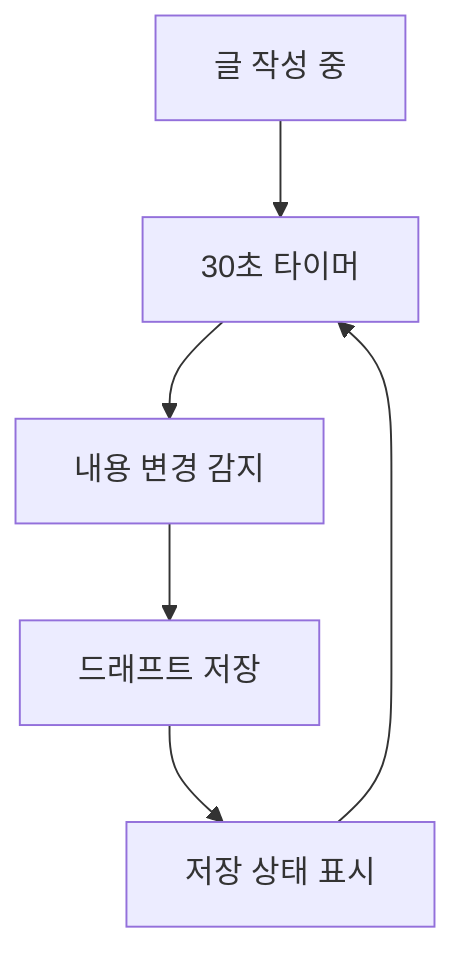

# 📝 NoteRoom 글 작성/편집 시스템 v2.0

## 🎯 **개요**
NoteRoom의 글 작성 및 편집 시스템을 완전히 재설계하여 사용자 경험을 개선하고 보안을 강화합니다.

## 🚀 **주요 기능**

### **1. 글 작성 모드** (`/write`)
- 새로운 글 작성
- 실시간 임시저장
- 드래프트 관리
- 이미지 업로드 및 관리

### **2. 편집 모드** (`/write?editId=xxx`)
- 기존 글 수정
- 변경사항 추적
- 수정 권한 검증
- 이미지 교체/삭제

### **3. 임시저장 시스템**
- 자동 임시저장 (30초마다)
- 수동 임시저장
- 드래프트 목록 관리
- 복구 기능

## 🔒 **보안 요구사항**

### **Firestore 규칙**
```javascript
// 노트 컬렉션
match /notes/{noteId} {
  // 읽기: 공개 노트는 모든 사용자, 비공개는 작성자만
  allow read: if resource.data.isPublic == true || 
                 (isAuthenticated() && resource.data.userUid == request.auth.uid);
  
  // 생성: 인증된 사용자만
  allow create: if isAuthenticated() && 
                   request.resource.data.userUid == request.auth.uid &&
                   isValidNoteData(request.resource.data);
  
  // 수정: 작성자만
  allow update: if isAuthenticated() && 
                   resource.data.userUid == request.auth.uid &&
                   isValidNoteUpdate(resource.data, request.resource.data);
  
  // 삭제: 작성자만
  allow delete: if isAuthenticated() && 
                   resource.data.userUid == request.auth.uid;
}

// 드래프트 컬렉션 (임시저장)
match /drafts/{draftId} {
  allow read, write: if isAuthenticated() && 
                        request.auth.uid == resource.data.userUid;
}
```

### **Storage 규칙**
```javascript
// 노트 이미지
match /notes/{userId}/{imageId} {
  allow read: if true; // 공개 읽기
  allow write: if isAuthenticated() && 
                  request.auth.uid == userId &&
                  isValidImageFile();
}

// 드래프트 이미지
match /drafts/{userId}/{imageId} {
  allow read, write: if isAuthenticated() && 
                        request.auth.uid == userId &&
                        isValidImageFile();
}
```

## 📊 **데이터 구조**

### **노트 문서 구조**
```typescript
interface Note {
  id: string;
  title: string;
  content: string; // HTML
  category: string;
  userUid: string;
  author: string;
  thumbnail?: string;
  images: string[]; // 본문 이미지 URLs
  isPublic: boolean;
  isDraft: boolean;
  tags: string[];
  likes: number;
  views: number;
  commentCount: number;
  createdAt: Timestamp;
  updatedAt: Timestamp;
  publishedAt?: Timestamp;
}
```

### **드래프트 문서 구조**
```typescript
interface Draft {
  id: string;
  title: string;
  content: string;
  category: string;
  userUid: string;
  thumbnail?: string;
  images: string[];
  isAutoSaved: boolean;
  lastSavedAt: Timestamp;
  createdAt: Timestamp;
  expiresAt: Timestamp; // 30일 후 자동 삭제
}
```

## 🔄 **작업 흐름**

### **1. 새 글 작성**
```mermaid
graph TD
    A[/write 접속] --> B[빈 에디터 로드]
    B --> C[사용자 입력]
    C --> D[30초마다 자동 임시저장]
    D --> E[발행 버튼 클릭]
    E --> F[유효성 검증]
    F --> G[이미지 업로드]
    G --> H[노트 저장]
    H --> I[드래프트 삭제]
    I --> J[메인 페이지 이동]
```

### **2. 글 편집**
```mermaid
graph TD
    A[/write?editId=xxx 접속] --> B[기존 노트 로드]
    B --> C[권한 검증]
    C --> D[에디터에 내용 로드]
    D --> E[사용자 수정]
    E --> F[변경사항 추적]
    F --> G[수정 완료]
    G --> H[업데이트 저장]
    H --> I[메인 페이지 이동]
```

### **3. 임시저장**


## 🛠️ **구현 세부사항**

### **1. 컴포넌트 구조**
```
src/features/WritePage/
├── WriteEditor.jsx          # 메인 에디터 컴포넌트
├── EditorToolbar.jsx        # 에디터 툴바
├── ImageManager.jsx         # 이미지 관리
├── DraftManager.jsx         # 임시저장 관리
├── PublishButton.jsx        # 발행 버튼
└── hooks/
    ├── useAutoSave.js       # 자동 저장 훅
    ├── useImageUpload.js    # 이미지 업로드 훅
    └── useDraftManager.js   # 드래프트 관리 훅
```

### **2. 상태 관리**
```typescript
interface WriteState {
  // 기본 정보
  title: string;
  content: string;
  category: string;
  isPublic: boolean;
  tags: string[];
  
  // 이미지 관리
  thumbnail: File | string | null;
  contentImages: (File | string)[];
  
  // 상태
  isLoading: boolean;
  isSaving: boolean;
  isDirty: boolean;
  lastSaved: Date | null;
  
  // 편집 모드
  isEditMode: boolean;
  originalNote: Note | null;
  
  // 에러 처리
  errors: Record<string, string>;
}
```

### **3. API 함수**
```typescript
// 노트 관련
export const createNote = async (noteData: CreateNoteData): Promise<string>;
export const updateNote = async (noteId: string, updateData: UpdateNoteData): Promise<void>;
export const deleteNote = async (noteId: string): Promise<void>;
export const getNoteById = async (noteId: string): Promise<Note>;

// 드래프트 관련
export const saveDraft = async (draftData: DraftData): Promise<string>;
export const loadDraft = async (draftId: string): Promise<Draft>;
export const deleteDraft = async (draftId: string): Promise<void>;
export const getUserDrafts = async (userId: string): Promise<Draft[]>;

// 이미지 관련
export const uploadNoteImage = async (file: File, userId: string): Promise<string>;
export const uploadDraftImage = async (file: File, userId: string): Promise<string>;
export const deleteImage = async (imageUrl: string): Promise<void>;
```

## 🎨 **UI/UX 개선사항**

### **1. 실시간 상태 표시**
- 저장 상태 인디케이터
- 자동 저장 타이머
- 변경사항 표시

### **2. 이미지 관리**
- 드래그 앤 드롭 업로드
- 이미지 미리보기
- 진행률 표시
- 에러 처리

### **3. 키보드 단축키**
- `Ctrl+S`: 수동 저장
- `Ctrl+Enter`: 발행
- `Ctrl+Z`: 실행 취소
- `Ctrl+Y`: 다시 실행

## 🔍 **테스트 계획**

### **1. 단위 테스트**
- 각 컴포넌트 테스트
- 훅 테스트
- API 함수 테스트

### **2. 통합 테스트**
- 전체 작성 플로우
- 편집 플로우
- 임시저장 플로우

### **3. E2E 테스트**
- 사용자 시나리오 테스트
- 브라우저 호환성 테스트
- 모바일 테스트

## 📈 **성능 최적화**

### **1. 코드 분할**
- 에디터 컴포넌트 지연 로딩
- 이미지 처리 라이브러리 분할

### **2. 메모리 관리**
- 이미지 캐싱
- 컴포넌트 언마운트 시 정리
- 메모리 누수 방지

### **3. 네트워크 최적화**
- 이미지 압축
- 배치 업로드
- 재시도 로직

## 🚀 **배포 계획**

### **Phase 1: 기본 구조**
- 새로운 WriteEditor 컴포넌트
- 기본 CRUD 기능
- 보안 규칙 적용

### **Phase 2: 임시저장**
- 자동 저장 기능
- 드래프트 관리
- 복구 기능

### **Phase 3: 고급 기능**
- 이미지 관리 개선
- 키보드 단축키
- 성능 최적화

### **Phase 4: 테스트 & 최적화**
- 전체 테스트
- 성능 튜닝
- 사용자 피드백 반영

## 📝 **마이그레이션 계획**

### **1. 기존 데이터 호환성**
- 기존 노트 구조 유지
- 점진적 마이그레이션
- 백업 및 복구 계획

### **2. 사용자 경험**
- 기존 기능 유지
- 새 기능 점진적 도입
- 사용자 가이드 제공

---

## 🎯 **다음 단계**

1. **Phase 1 구현 시작**
2. **보안 규칙 업데이트**
3. **기본 컴포넌트 개발**
4. **테스트 환경 구축**

이 문서는 개발 진행에 따라 지속적으로 업데이트됩니다. 